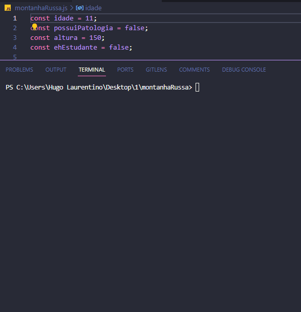

<h1 align="center">
  
</h1>

- [x] Bak-End
- [x] Criar Título
- [x] Criar Descrição
- [x] Sobre
- [x] Tecnologia
- [x] Pre requisito
- [x] Autor
- [x] GIF‘s

---
<h1 align='center'>Isenção de Impostos (IR)</h1>

<p align='center'>Esse é um exemplo de lógica em javascript</p>
<p align='center'>
 Num parque de diversões existe uma Montanha Russa Muito Assustadora.
</p>

<p align='center'>
 <a href='#sobre'>Sobre</a> |
 <a href='#pré-requisitos'>Pre Requisitos</a> |
 <a href='#tecnologias'>Tecnologias</a> |
 <a href='#autor'>Autor</a>
</p>

---
<h1 align='center'>
 
</h1>

---

### Sobre

  <p align= 'justify'>
  Por isso, nesta montanha russa não são permitidas pessoas:

    - Menores de 12 anos
    - Maiores de 65 anos
    - Que possuam qualquer patologia cardíaca
    - Menores de 150cm de altura
  
  Para as pessoas que podem brincar na montanha russa, a tabela de preços é a seguinte:

    - 10 reais caso a pessoa seja estudante ou menor de 18 anos (meia entrada)
    - 20 reias, caso contrário

  Seu papel é imprimir na tela:

    - ACESSO NEGADO caso a pessoa não possa brincar
    - 10 reais caso esse seja o valor que a pessoa deve pagar para brincar
    - 20 reais caso esse seja o valor que a pessoa deve pagar para brincar
  </p>

---

### Pré-requisitos

Antes de começar, você vai precisar ter instalado em sua máquina as seguintes FERRAMENTAS: [GIT](https://git-scm.com/), [Node.js](https://nodejs.org/en/download).
Além disto é bom ter um editor para trabalhar com o código como [VSCode](https://code.visualstudio.com/download).

### 🎲 Rodando o Back End

```bash
# Clone este repositório
$ git clone https://github.com/hugolaurentino/montanhaRussa.git

# Acesse a pasta do projeto no terminal/cmd
$ cd montanhaRussa

# Instale as dependências
$ npm install

# Execute 
$ node .\montanhaRussa.js

```
### Tecnologias

As seguintes ferramentas foram usadas na construção do projeto:

- [Node.js][nodejs]

---
###### tags: `lógica` `matemática` `nodeJS`
## Autor
Feito com ❤️ por Hugo Laurentino 👋🏽 [Entre em contato!](https://www.linkedin.com/in/hugo-laurentino-silva/)

[nodejs]: https://nodejs.org/
